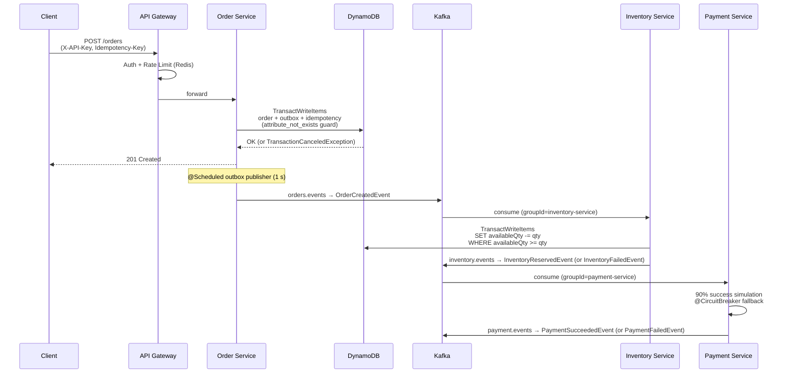

# OrderFlow — Production-Quality Java Microservices on AWS

A fully-featured interview reference project demonstrating distributed systems patterns,
event-driven architecture, and AWS-native infrastructure as code.

## Architecture



## Tech Stack

| Layer | Technology | Version |
|---|---|---|
| Language | Java | 21 (virtual threads ready) |
| Framework | Spring Boot | 3.4.3 |
| Service mesh | Spring Cloud Gateway | 2024.0.1 (Mooregate) |
| NoSQL | DynamoDB (AWS SDK v2) | 2.29.x |
| Messaging | Kafka (spring-kafka) | 3.3.x |
| Resilience | Resilience4j | 2.3.0 |
| Rate limiting | Redis (reactive) | 7.4 |
| Observability | Micrometer + OTel | — |
| Build | Maven multi-module | 3.9.x |
| Containers | Docker (Temurin 21 JRE Alpine) | — |
| IaC | Terraform | ≥ 1.9 |
| Deploy | AWS ECS Fargate | — |
| CI/CD | GitHub Actions + OIDC | — |

## Project Structure

```
.
├── common/                   # Shared event records + DTOs (not a Spring app)
├── order-service/            # REST API + transactional outbox
├── inventory-service/        # Kafka consumer + conditional DynamoDB updates
├── payment-service/          # Kafka consumer + circuit-breaker payment sim
├── api-gateway/              # Spring Cloud Gateway + Redis rate limiter
├── infra/                    # Terraform modules (ECR, ECS, IAM, Secrets, DynamoDB, Kafka EC2)
│   ├── modules/
│   │   ├── dynamodb/         # 5 DynamoDB tables with correct schemas and GSIs
│   │   ├── ecr/              # 4 ECR repos with lifecycle policies
│   │   ├── ecs/              # Fargate cluster, ALB, 4 services, Service Connect, deploy circuit breaker
│   │   ├── iam/              # Task role, execution role, GitHub OIDC role
│   │   ├── kafka_ec2/        # EC2 t3.micro running Kafka + Redis (auto-configured via user_data)
│   │   ├── networking/       # Default VPC data source
│   │   └── secrets/          # Secrets Manager (Kafka, API keys)
│   └── terraform.tfvars.example  # Variable template (copy to terraform.tfvars)
├── .github/workflows/
│   ├── ci.yml                # Unit tests + OWASP dependency-check on PR
│   └── cd.yml                # OIDC → ECR push → ECS rolling deploy (matrix)
├── bootstrap.sh              # One-time setup: S3 bucket, SSH key, terraform.tfvars
├── deploy.sh                 # Post-terraform: build images, update secrets, deploy, seed, smoke-test
├── up.sh                     # Single entry point: runs bootstrap → terraform → deploy
├── docker-compose.yml        # Full local stack (all services + infra)
├── scripts/
│   ├── smoke-test.sh         # End-to-end API validation
│   ├── build-and-push.sh     # Maven build + Docker build + ECR push
│   ├── update-task-defs.sh   # ECS task definition update + rolling deploy
│   ├── seed-inventory.sh     # Idempotent DynamoDB inventory seed
│   └── wait-for-kafka.sh     # SSM-based Kafka readiness poll (no SSH needed)
└── .env.example              # All configurable environment variables
```

## Local Quick Start

**Prerequisites:** Docker Desktop, Java 21, Maven

```bash
# 1. Clone and build
git clone https://github.com/YOUR_ORG/java-spring-boot-aws-microservices
cd java-spring-boot-aws-microservices

# 2. Start the full stack (builds all 4 service images)
docker compose up --build

# Services take ~90 s to start. Watch logs:
docker compose logs -f order-service

# 3. Smoke test (in a new terminal, once all services are healthy)
chmod +x scripts/smoke-test.sh
./scripts/smoke-test.sh

# 4. UI tools
open http://localhost:8001   # DynamoDB Admin
open http://localhost:8090   # Kafka UI

# 5. Create an order manually
curl -X POST http://localhost:8080/orders \
  -H "Content-Type: application/json" \
  -H "X-API-Key: dev-key-1" \
  -H "Idempotency-Key: $(uuidgen)" \
  -d '{
    "customerId": "customer-123",
    "items": [
      {"skuId":"SKU-001","productName":"Widget Pro","quantity":2,"unitPrice":29.99}
    ]
  }'
```

## AWS Deployment

### Automated Setup (recommended)

Everything — S3 state bucket, EC2 Kafka+Redis, DynamoDB tables, ECS services, Docker images,
inventory seed — is provisioned automatically by three scripts.

**Prerequisites:** AWS CLI configured, Docker, Java 21, Terraform ≥ 1.9, `jq`, `python3`

```bash
# Single command: bootstrap → terraform apply → deploy → smoke-test
./up.sh YOUR_GITHUB_USERNAME
```

Or step by step if you want to review each phase:

```bash
# Step 1 — One-time bootstrap (creates S3 bucket, SSH key, terraform.tfvars)
./bootstrap.sh YOUR_GITHUB_USERNAME

# Step 2 — Provision all infrastructure (~5 minutes)
cd infra
terraform init
terraform apply -var-file=terraform.tfvars
cd ..

# Step 3 — Build images, deploy to ECS, seed data, smoke-test (~10 minutes)
./deploy.sh
```

What gets created automatically:
- S3 bucket for Terraform state
- EC2 t3.micro running Kafka 4.x + Redis 6 (configured via `user_data` on first boot)
- All 5 DynamoDB tables with correct schemas and GSIs
- ECS Fargate cluster with 4 services behind an ALB
- ECS Service Connect so services discover each other by DNS (no hardcoded IPs)
- ECR repositories, IAM roles, Secrets Manager secrets, CloudWatch log groups
- Inventory seed data (SKU-001, SKU-002, SKU-003)

### Manual Setup (step-by-step with verification)

See [`AWS_Deploy.md`](AWS_Deploy.md) for a detailed walkthrough with a verification
command after every step. Useful if the automated setup fails partway through or
you want to understand what each step does.

Additional reference guides:
- [`Kafka_Install.md`](Kafka_Install.md) — manual Kafka 4.x installation on EC2
- [`Redis_Install.md`](Redis_Install.md) — manual Redis 6 installation on EC2
- [`AWS_Billing.md`](AWS_Billing.md) — cost breakdown, how to pause and resume, full teardown

### GitHub Actions (CI/CD)

After `terraform apply`, set one repository variable in
**Settings → Secrets and variables → Actions → Variables**:

| Variable | Value |
|---|---|
| `AWS_ACCOUNT_ID` | your 12-digit AWS account ID |
| `ENVIRONMENT` | `dev` |

The GitHub Actions OIDC role is created by Terraform automatically — no AWS credentials
need to be stored in GitHub.

### CI/CD Flow

```
PR opened  →  ci.yml: mvn test + OWASP check
Merge to main →  cd.yml:
  OIDC auth (15-min token, no stored keys)
  Matrix build  [order-service, inventory-service, payment-service, api-gateway]  ← parallel
  ECR push (sha + latest tags)
  Matrix deploy [describe task def → update image → register → update-service]    ← parallel
  aws ecs wait services-stable  (or circuit breaker rolls back)
```

## Design Decisions

### 1. Transactional Outbox Pattern
Direct Kafka publish after a DB write creates a **dual-write problem** — the DB write can succeed but the Kafka publish can fail, leaving the system in an inconsistent state. The outbox pattern writes the event as a row in `order_outbox` **in the same DynamoDB transaction** as the order row. A scheduled publisher then reliably delivers it to Kafka and marks it published only after Kafka ACK.

### 2. DynamoDB `TransactWriteItems` for Idempotency
`POST /orders` uses a three-way transaction:
- `PutItem` → orders table
- `PutItem` → order_outbox table
- `PutItem` → order_idempotency_keys with `ConditionExpression: attribute_not_exists(PK)`

If the idempotency key already exists DynamoDB throws `TransactionCanceledException` and none of the three writes are applied. The service then fetches and returns the cached response — fully atomic, no application-level locks needed.

### 3. `@RetryableTopic` vs `SeekToCurrentErrorHandler`
Non-blocking retries (`@RetryableTopic`) route failed messages to a `*-retry` topic with a configurable delay. The main partition continues processing other messages. The old `SeekToCurrentErrorHandler` would **stall the entire consumer group** at the failed offset until the retry succeeds — unacceptable in production.

### 4. GitHub OIDC vs IAM Access Keys
OIDC tokens are **15-minute, single-use, scoped to repo+branch**. No long-lived credentials stored in GitHub Secrets. IAM access keys are long-lived, easily leaked in logs, and require manual rotation. The trust policy's `StringLike` condition on `token.actions.githubusercontent.com:sub` prevents any other repo from assuming the role.

### 5. ECS Deployment Circuit Breaker
`deployment_circuit_breaker { enable = true, rollback = true }` instructs ECS to monitor the rolling deploy. If the new revision fails its health checks, ECS automatically rolls back to the last stable task definition — no manual intervention needed.

### 6. Conditional DynamoDB Update for Inventory
```
SET availableQty = availableQty - :qty, reservedQty = reservedQty + :qty
WHERE availableQty >= :qty
```
This prevents overselling without distributed locks. If any SKU in the order has insufficient stock, the entire `TransactWriteItems` is cancelled atomically — no partial reservations, no compensating transactions needed for the happy path.

### 7. PAY_PER_REQUEST Billing
Zero cost at zero traffic. Ideal for bursty demo workloads and eliminates capacity planning. Automatically scales to millions of requests/second.
